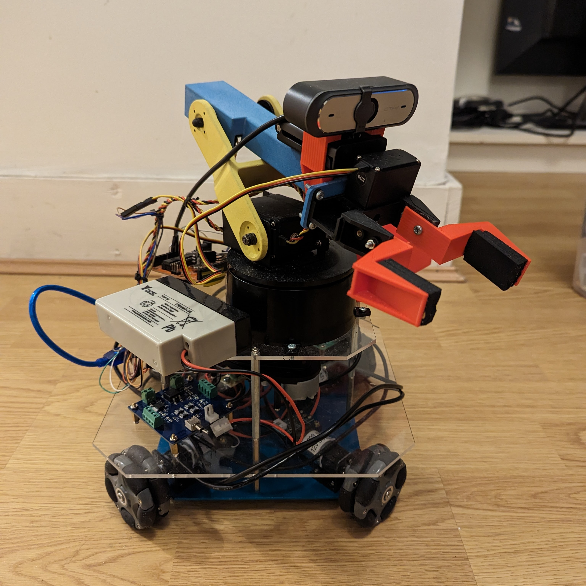

# Assistive Robot for Carrying Out Household Activities

This repository contains the source code, configurations and documentation for an autonomous assistive robot developed as a final project at UCL. The system is designed to perform household tasks by combining advanced computer vision, multimodal control, autonomous navigation and wireless communication.

> **Key Highlights:**
>
> - **Wireless Communication:** Utilises RF transceivers (nRF24L01 modules) to transfer commands from the computer to the robot without any physical tether.
> - **Grabber & Object Retrieval Pipeline:** The system includes a grabber that leverages a custom YOLOv5 object recognition model to detect, approach and grasp target items.
> - **Manual Mode (MediaPipe Hand Gesture Control):** In manual mode, your hand and arm act as a natural controller. MediaPipe extracts detailed hand and arm landmarks that represent joint angles and control the opening and closing of the grabber, so the robot replicates your intended movements.
> - **Default (Holistic) Mode:** When set to default mode, the robot uses the MediaPipe Holistic model to track your full body and, with the help of SLAM data, follows you safely whilst maintaining a safe distance to avoid collisions.
> - **Full Object Retrieval Pipeline:** The system autonomously scans the room using SLAM, detects the desired object with YOLOv5, rotates to properly visualise the target, approaches and picks up the item with its robotic arm, and finally returns to its starting position.
> - **Voice Command Integration:** Continuous speech transcription (via Google’s Speech-to-Text API) processes spoken commands such as “manual”, “grab the orange” or “quit”, and switches the robot into corresponding modes automatically.

---

## Table of Contents

- [Overview](#overview)
- [Features](#features)
- [System Architecture](#system-architecture)
  - [Object Recognition with YOLOv5](#object-recognition-with-yolov5)
  - [MediaPipe for Hand Gesture & Holistic Control](#mediapipe-for-hand-gesture--holistic-control)
  - [SLAM and Autonomous Navigation](#slam-and-autonomous-navigation)
  - [Voice Command Integration](#voice-command-integration)
  - [Wireless Communication](#wireless-communication)
- [Installation and Setup](#installation-and-setup)
- [Usage](#usage)
- [Repository Structure](#repository-structure)
- [Future Work](#future-work)
- [Acknowledgements and References](#acknowledgements-and-references)

---

## Overview

In today’s evolving landscape of assistive technology, this project addresses the need for helpful domestic robots by integrating:
- **Computer Vision:** A custom-trained YOLOv5 model to detect and classify common household objects (for instance, an orange, fork, phone, can and mouse).
- **Multimodal Control:** Utilisation of MediaPipe to extract both detailed hand gestures and holistic full-body poses.
- **Autonomous Navigation:** SLAM (using a LiDAR sensor) enables the robot to build a map of the environment, while ROS2’s Nav2 stack plans collision-free paths.
- **Voice Command Processing:** A continuous speech recognition pipeline that converts audio to text and tokenises commands to engage different modes.

---

## Features

- **Object Recognition with YOLOv5:**
  - A custom dataset comprising over 500 images (across five object classes) is used for training.
  - Real-time detection with high confidence (typically above 0.8) guides the grabber for object retrieval.
  
- **MediaPipe-Based Hand Gesture Control (Manual Mode):**
  - The MediaPipe Hands model extracts 21 hand landmarks, which are processed to compute joint angles.
  - Your hand and arm movements directly control the robot’s arm motions and the grabber’s opening/closing mechanism, allowing the robot to mimic your precise gestures.
  
- **Default (Holistic) Mode and Person Tracking:**
  - The holistic model monitors full-body pose to make the robot follow your movements.
  - Coupled with SLAM information, the robot maintains a safe distance so as not to collide with you.
  
- **Full Object Retrieval Pipeline:**
  - **Navigation to the Object:** The robot uses previously mapped SLAM data and Nav2 path planning.
  - **Initial Scanning:** The robot rotates until the YOLOv5 module confirms the target object is in view.
  - **Object Tracking & Picking:** With precise bounding box information from YOLOv5, the robot approaches and activates the grabber to pick up the object.
  - **Object Placing & Return:** The item is deposited into an onboard basket or holder and the robot navigates back to its starting location.
  
- **Voice Command Integration:**
  - Continuously listens for spoken commands.
  - Transcribes and tokenises keywords (e.g. “manual”, “grab the orange”, “default”, “quit”) to trigger the appropriate control mode automatically.
  
- **Wireless Communication:**
  - Command signals are transmitted from the computer to the robot wirelessly using RF transceivers, thus realising complete wireless operation without reliance on cables.

---

## System Architecture

### Object Recognition with YOLOv5

- **Dataset and Training:**  
  - Over 500 photographs of common household items taken under varying conditions are annotated for training.
  - The model is trained using libraries such as PyTorch and OpenCV, with performance monitored via losses (box regression, objectness and classification) and metrics (Precision, Recall, mAP).
  
- **Deployment:**  
  - The best-performing model is implemented in the object detection pipeline to reliably guide the grabber during the object retrieval procedure.

### MediaPipe for Hand Gesture & Holistic Control

- **Manual Mode:**  
  - The system employs the MediaPipe Hands model to extract detailed hand landmarks, which are converted into joint angle data.
  - Custom functions compute joint angles and apply smoothing, allowing your natural hand movements to control the robot’s arm and grabber.
  
- **Default Mode:**  
  - The holistic model monitors your overall pose, enabling the robot to follow you.
  - This mode, combined with SLAM-based navigation, ensures that the robot maintains a safe distance from you while following your movements.

### SLAM and Autonomous Navigation

- **Mapping:**  
  - A LiDAR sensor (RPLiDAR A1) gathers environmental data to build an accurate 2D map.
  
- **Navigation:**  
  - Using ROS2’s Nav2 stack and custom control nodes, the robot computes and follows safe, collision-free paths in real time.
  - The system is designed to compensate for potential wheel slippage and utilise a canonical scan matcher for odometry.

### Voice Command Integration

- **Continuous Speech Recognition:**  
  - The SpeechRecognition module utilises Google’s API to convert spoken commands into text.
  
- **Command Tokenisation:**  
  - The transcribed audio is scanned for key phrases which trigger mode transitions (e.g. switching to “manual” mode or initiating an object retrieval sequence).

### Wireless Communication

- **RF Transceivers:**  
  - Low-latency wireless communication is achieved using nRF24L01 modules.  
  - This enables the host computer to send control commands to the robot without any wires, ensuring true mobility.

---

## Installation and Setup

### Prerequisites

- **Hardware:**
  - A robot base with omnidirectional wheels, a 3-DOF robot arm with a grabber.
  - LiDAR sensor (RPLiDAR A1).
  - Arduino Mega (or equivalent) integrated with RF transceiver (nRF24L01).
  - ESP-32 CAM (optional – for wireless video streaming).
  
- **Software:**
  - ROS2 (Foxy or later recommended)
  - Python 3.7+ with:
    - PyTorch, OpenCV, NumPy
    - SpeechRecognition, MediaPipe
  - Arduino IDE for programming the microcontrollers.

### Setup Steps

1. **Clone the Repository:**

   ```bash
   git clone https://github.com/your-username/assistive-robot.git
   cd assistive-robot
2. **Install Python Dependencies:**
   ```bash
   pip install -r requirements.txt
3. **Configure ROS2:**

   *Set up your ROS2 workspace: Create and initialise your ROS2 workspace with all necessary dependencies for the project.

   *Build custom nodes:  
   - Build nodes for the controller to handle robot motion.  
   - Set up SLAM-related nodes for environmental mapping.  
   - Create navigation nodes for autonomous movement planning.

   *Validate the URDF file: Ensure that the URDF file accurately represents your robot’s physical dimensions and configurations.

4. **Flash Microcontroller Code:**
*Arduino Setup:*  
   - Open the Arduino sketches located in the `/arduino` directory.  
   - Flash the appropriate sketches for:
     - Serial Communication.
     - RF Transmitter and Receiver modules.

   *ESP-32 CAM Setup (Optional):  
   - If using the ESP-32 CAM for wireless video streaming, update the Wi-Fi credentials in the `/esp32_cam/esp32_cam_code.ino` file.  
   - Programme the board with the updated code using the Arduino IDE.

## Usage

### Modes of Operation

#### Manual Mode:
- **Control:** Use your hand as a natural controller. MediaPipe extracts your hand and arm joint data, interpreting movements into robot arm joint angles. This allows you to directly command the robot’s grabber to open or close, replicating your motions in real time.

#### Default (Holistic) Mode:
- **Follow-Me Behaviour:** The robot tracks your full-body pose using the MediaPipe holistic model while utilising SLAM data to safely follow you. The system maintains a safe distance to avoid collisions, ensuring smooth and safe operation.

#### Object Mode (Full Retrieval Pipeline):
When you issue a command such as “grab the orange” (via voice or through a user interface), the robot executes the following pipeline:
1. **Scan the Environment:** The robot rotates until the YOLOv5 module detects the target object.
2. **Track and Approach:** Uses the detected bounding box from YOLOv5 to guide the robot closer to the object.
3. **Pick-Up:** Activates the grabber to securely grasp the object.
4. **Place and Return:** Deposits the object into an onboard holder and navigates back to its starting position.

---

### Voice Commands
- Simply speak commands, such as:
  - **“manual”** to switch to hand gesture control.
  - **“grab the orange”** to initiate the object retrieval pipeline.
  - **“default”** to enable follow-me behaviour.
  - **“quit”** to terminate the current mode.
- The system tokenises the transcribed input and automatically transitions to the specified mode.

---

### Wireless Operation
- The host computer communicates with the robot using RF transceivers (nRF24L01), enabling fully wireless control. This setup ensures seamless transfer of control commands, providing operational freedom and mobility.


## Repository Structure

- **arduino/**  
  Contains Arduino sketches used for robot control and wireless communication:
  - `SerialCommunication.ino` - Code for wired serial communication.
  - `RF_Transmitter.ino` - Code for RF transmission.
  - `RF_Receiver.ino` - Code for RF reception.
  - `Final_Transmitter_Receiver.ino` - Finalised RF communication setup.

- **docs/**  
  Includes project documentation:
  - `Final_Report.pdf` - Detailed final report outlining the project's goals, methodology, and results.

- **ros2_nodes/**  
  ROS2 packages and configurations:
  - `custom_controller/` - ROS2 controller for omnidirectional base.
  - `slam_toolbox_config/` - Configuration files for SLAM toolbox.
  - `navigation/` - Navigation stack-related setup files.

- **python/**  
  Python scripts for various functionalities:
  - **yolo/**
    - `train.py` - Script to train the YOLOv5 model.
    - `detect.py` - Script to run object detection in real time.
    - `dataset.yml` - YOLO training dataset configuration.
  - **mediapipe/**
    - `hand_gesture.py` - Code for hand gesture recognition.
    - `holistic_tracking.py` - Code for holistic full-body pose tracking.
    - `get_label.py` - Helper function for identifying left/right hands in MediaPipe.
  - `voice_control.py` - Script for voice command recognition using Google Speech-to-Text.
  - `main_control.py` - Main integration script combining voice, vision, and navigation.

- **esp32_cam/**  
  - `esp32_cam_code.ino` - Code for setting up wireless video streaming using ESP-32 CAM.

- **README.md**  
  The main project documentation file (this file).


## Future Work

1. **Enhanced Object Recognition:**  
   - Increase the number of training images per class to further improve the robustness and accuracy of the YOLOv5 model.

2. **Fully Wireless Vision:**  
   - Develop a solution for wireless video streaming to make the robot completely untethered and independent of physical connections.

3. **Improved Navigation:**  
   - Optimise the robot’s omnidirectional kinematics for smoother and more efficient movements.  
   - Further refine SLAM parameters to improve map accuracy and navigation performance.

4. **Integrated User Interface:**  
   - Combine map visualisation with interactive controls, such as a touchscreen or web interface, to streamline robot control and enhance usability.

5. **Onboard Processing Enhancements:**  
   - Upgrade to more powerful onboard platforms, such as the NVIDIA Jetson AGX Xavier, to enable faster, real-time object recognition and increased overall system performance.

---

## Acknowledgements and References

Special thanks to the UCL team and supervisors for their continual guidance and support throughout the project. A detailed explanation of the methodologies and contributions can be found in the [Final_Report.pdf](docs/Final_Report.pdf).

For further information, please consult the following resources:  
- [MediaPipe Documentation](https://github.com/google/mediapipe)  
- [YOLOv5 Guide on Roboflow](https://blog.roboflow.com/yolov5-improvements-and-evaluation/)  
- [ROS2 Documentation](https://docs.ros.org)

---

Feel free to open an issue or submit a pull request if you have any questions or ideas for improvement. Contributions and feedback are always welcome!


## Robot Pictures and Object Detection

Below are some images showcasing the robot in action across its various modes and functionalities.

### 1. **Robot – Front View**
  
*Description:* This image shows the front of the robot with the camera, the grabber and the base and wheels showing.

### 2. **Robot – Side View**
  
*Description:* The Image shows a side-view of the robot with a place to hold the item grabbed.

### 3. **Object Detection - Many Items**
  
*Description:* This picture shows the detection of many objects

### 4. **Object Detection - Confidence Comparison in Approach for Grab**
  
*Description:* The image shows how when approaching, the item with higher confidence score is approached shown by the red light in the middle of the detected object.

